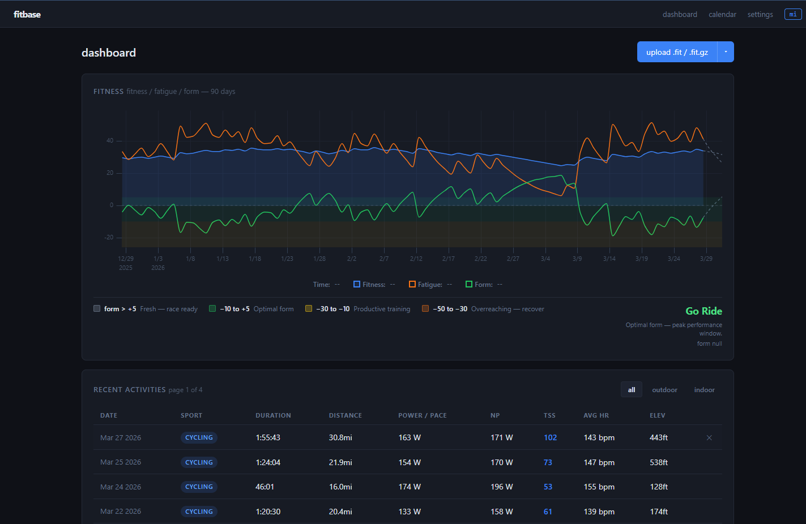

# fitbase

[](https://github.com/jonathanzuramski/fitbase/actions/workflows/ci.yml)
[](https://go.dev)
[](LICENSE)

Self-hosted fitness platform for endurance athletes. Your data, on your machine.

The big players in the fitness industry, Garmin Connect, Wahoo, TrainingPeaks - lock your workout data behind their cloud platforms, make exports painful, and charge subscriptions for analysis you could do yourself. Getting a simple CSV of your own power data shouldn't require a premium plan.

fitbase takes a different approach: sync your FIT files through whatever path works for you, Dropbox, intervals.icu, USB, or direct upload, and store everything locally in a SQLite database you own. A clean REST API makes your data accessible to LLM coaching agents, custom dashboards, or anything else you want to build.

**No cloud dependency. No subscriptions. No data hostage situations.**



---

## Features

- **Automatic import** - drop a `.fit` file into a watched directory and it gets parsed and stored
- **intervals.icu sync** - pull activities from intervals.icu (aggregates from Wahoo Cloud, Garmin Connect, Strava, etc.)
- **Dropbox sync** - import FIT files from a Dropbox folder (Wahoo head units can sync there directly)
- **Power analytics** - Normalized Power, Intensity Factor, TSS, Variability Index, eFTP
- **All-time power curve** - best efforts at every duration, with a grey reference overlay on each ride to show PRs
- **Heart rate analytics** - hrTSS for non-power activities (running, hiking), HR zones, Efficiency Factor
- **Training load** - Fitness/Fatigue/Form chart with 180-day EMA warmup so values are accurate from day one
- **Zone-colored charts** - power and HR charts colored by training zone with dynamic smoothing
- **GPS route map** - Leaflet dark-tile map, route colored by power/HR zone
- **Dashboard sorting** - sort by date, sport, duration, distance, power, NP, TSS, HR, or elevation
- **Google Drive backup** - FIT files archived to Drive automatically, full restore in one command
- **LLM-ready API** - compact `/summary` endpoint for function-calling and coaching agents
- **Mobile-ready** - responsive layout, works on phone
- **Single binary** - pure Go, no CGO, no npm, no Docker required

---

## Quick start

### Docker Compose (recommended)

```bash
docker compose up -d
```

That's it. This uses the `docker-compose.yml` included in the repo, which pulls the pre-built image from GitHub Container Registry.

To use a host path instead of a Docker volume:

```bash
docker run -d --name fitbase --restart unless-stopped \
  -p 8780:8780 \
  -v /path/to/your/data:/data \
  ghcr.io/jonathanzuramski/fitbase:latest
```

All data (database, encryption key, archived FIT files) lives in `/data` inside the container.

Open `http://localhost:8780` to get started.

### TrueNAS (step by step)

TrueNAS Scale can run Docker containers through its Apps system. Here's how to get fitbase running.

The Docker image is published to GitHub Container Registry automatically on every push to main. The image name is:

```
ghcr.io/jonathanzuramski/fitbase:latest
```

**Step 1 - Create a dataset for fitbase data**

In the TrueNAS web UI:

1. Go to **Storage** (or **Datasets**)
2. Select your pool and click **Add Dataset**
3. Name it `fitbase` (e.g. the full path will be something like `/mnt/pool/apps/fitbase`)
4. Click **Save**

This gives fitbase a dedicated place on your pool to store its database, encryption key, and FIT file archive.

**Step 2 - Create a custom app**

1. Go to **Apps** in the TrueNAS web UI
2. Click **Discover Apps**, then **Custom App** (top right)
3. Paste the following into the YAML configuration:

```yaml
services:
  fitbase:
    image: ghcr.io/jonathanzuramski/fitbase:latest
    container_name: fitbase
    restart: unless-stopped
    ports:
      - "8780:8780"
    volumes:
      - /mnt/pool/apps/fitbase:/data
```

4. Update the volume path to match the dataset you created in Step 1
5. Click **Install**

TrueNAS will pull the image and start the container.

**Step 3 - Open fitbase**

Visit `http://<your-truenas-ip>:8780` in your browser. You'll see the welcome screen to set up your athlete profile.

### From Source

```bash
git clone https://github.com/jonathanzuramski/fitbase
cd fitbase
go build -o fitbase ./cmd/fitbase
./fitbase
```

Open `http://localhost:8080`. On first run you'll see a setup screen to enter your FTP, weight, and heart rate zones.

Drop a `.fit` file into `~/.fitbase/watch/` and it will be imported automatically.

---

## Configuration

All configuration is via environment variables. Defaults work out of the box.

| Variable              | Default                 | Description                                              |
| --------------------- | ----------------------- | -------------------------------------------------------- |
| `FITBASE_PORT`        | `8780`                  | HTTP listen port                                         |
| `FITBASE_DB_PATH`     | `~/.fitbase/fitbase.db` | SQLite database path                                     |
| `FITBASE_KEY_PATH`    | `~/.fitbase/master.key` | Path to your 32-byte AES-256 master key (see Security)   |
| `FITBASE_WATCH_DIR`   | `~/.fitbase/watch`      | Directory watched for new FIT files                      |
| `FITBASE_ARCHIVE_DIR` | `~/.fitbase/archive`    | Local archive of original FIT files                      |
| `FITBASE_DEV`         | `false`                 | Set to `true` to serve templates from disk (live reload) |

---

## Security - master key and token encryption

fitbase encrypts all integration credentials and OAuth tokens at rest using **AES-256-GCM** before writing them to the database. The encryption key is stored separately from the database so a leaked `.db` file alone is useless.

### How it works

- On first run fitbase generates a random 256-bit key and saves it to `~/.fitbase/master.key` with `0600` permissions (only your user account can read it)
- Every OAuth token in the database is encrypted with this key. What's in SQLite is ciphertext, not a readable token.
- The key and the database are kept in separate files. Back up **both** if you want to be able to restore.

### Bring Your Own Key (BYOK)

If you want to control the key yourself instead of using the auto-generated one:

**Step 1 - Generate a 32-byte key:**

```bash
# macOS / Linux
openssl rand -out ~/.fitbase/master.key 32
chmod 600 ~/.fitbase/master.key
```

```powershell
# Windows (PowerShell)
$key = New-Object byte[] 32
[Security.Cryptography.RNGCryptoServiceProvider]::Create().GetBytes($key)
[IO.File]::WriteAllBytes("$env:USERPROFILE\.fitbase\master.key", $key)
```

**Step 2 - Tell fitbase where the key is** (optional if using the default path):

```bash
export FITBASE_KEY_PATH=/path/to/your/master.key
```

**Step 3 - Start fitbase as normal.** It will use your key instead of generating one.

> **Important:** Back up your key file. If you lose it, stored OAuth tokens become unreadable and you'll need to reconnect each integration. Workout data is not affected.

> **Important:** Do not commit your key to version control. Add `master.key` to your `.gitignore`.

---

## Getting files onto fitbase

Most head units don't give you a clean way to get FIT files off the device without going through a proprietary cloud. Wahoo and Garmin both push to their own platforms first. fitbase pulls from intermediaries that actually let you access your data.

### Option 1 - intervals.icu (recommended)

[intervals.icu](https://intervals.icu) is a free training platform that can pull your activities from Wahoo Cloud, Garmin Connect, Strava, and others. Once your rides land in intervals.icu, fitbase syncs them.

1. In intervals.icu, connect your Wahoo or Garmin account under **Settings > Connections**
2. In fitbase, go to **Settings** and enter your intervals.icu Athlete ID and API key
3. Click **Sync Now** to pull your full history, or check **Sync future workouts** to have new rides appear automatically

This is the easiest path if your head unit syncs to any major cloud platform. intervals.icu acts as the bridge that gives you access to the raw FIT files.

### Option 2 - Dropbox

Wahoo head units can sync FIT files directly to Dropbox. If you have this set up:

1. In fitbase, go to **Settings** and enter your Dropbox access token and folder path
2. Click **Sync Now** to import existing files, or check **Sync future workouts** to auto-import new rides as they land

Only one integration can auto-sync future workouts at a time. Enabling one disables the other.

### Option 3 - Web upload

Use the upload button on the dashboard, or POST directly:

```bash
curl -X POST http://localhost:8080/api/upload \
  -F "file=@my_ride.fit"
```

Supports `.fit` and `.fit.gz` files. Bulk upload (multiple files at once) is supported through the UI.

### Option 4 - Watch directory (USB)

Plug your Wahoo ELEMNT or Garmin device in via USB. Copy `.fit` files from the device's `ACTIVITIES/` folder into `~/.fitbase/watch/`. fitbase detects new files automatically.

You can also point `FITBASE_WATCH_DIR` directly at the device's activity folder for automatic import on connect.

### Option 5 - Google Drive restore _(see below)_

---

## Google Drive integration

fitbase can back up every imported FIT file to Google Drive and restore your entire history onto a new server from Drive.

### How it works

- Every time a FIT file is imported, it gets uploaded to `fitbase-archive/YYYY/MM/{id}.fit` in your Google Drive in the background
- If you lose your server, a single restore command downloads everything from Drive and rebuilds the database

### Setup

1. Create an OAuth app in [Google Cloud Console](https://console.cloud.google.com). Enable the **Google Drive API**, then create **OAuth 2.0 credentials** (type: **Desktop application**)
2. In fitbase, go to **Settings > Google Drive** and enter your Client ID and Client Secret
3. Click **Connect Google Drive**. You'll be redirected to Google to authorize.

> **Note:** Google may show an "unverified app" warning. Click **Advanced > Go to fitbase (unsafe)** to proceed. The app only requests access to files _it creates_ and cannot read any other files in your Drive.

### Restoring from Google Drive

On a fresh install, after connecting Drive:

```bash
curl -X POST http://localhost:8080/api/integrations/gdrive/restore
```

```json
{ "data": { "total": 312, "imported": 312, "skipped": 0, "failed": 0 } }
```

---

## API

Full spec at [`openapi.yaml`](./openapi.yaml). Key endpoints:

```
# Workouts
GET    /api/workouts                  list workouts (limit/offset)
GET    /api/workouts/{id}             full workout data
DELETE /api/workouts/{id}             delete a workout
GET    /api/workouts/{id}/streams     per-second power, HR, cadence, GPS
GET    /api/workouts/{id}/summary     compact summary for LLM consumption
GET    /api/workouts/{id}/analysis    zone distribution, variability index, 90-day comparison
GET    /api/workouts/{id}/download    original .fit file
GET    /api/workouts/{id}/route       route history (all workouts on the same course)
POST   /api/upload                    upload a .fit or .fit.gz file

# Athlete
GET  /api/athlete                     athlete profile
PUT  /api/athlete                     update profile (FTP, weight, HR zones, etc.)
GET  /api/athlete/zones               power zones (Z1–Z7 + Sweet Spot) and HR zones
GET  /api/athlete/power-curve         all-time best power: 5s, 30s, 1min, 5min, 20min, 60min
GET  /api/athlete/readiness           today's coaching snapshot: form, ramp rate, recommendation

# Training
GET  /api/fitness?days=90             daily Fitness/Fatigue/Form history (EMA)
GET  /api/training/weekly?weeks=12    per-week TSS, duration, distance, load classification
```

### LLM / agent usage

The API is designed for AI coaching agents. A recommended call sequence:

1. `GET /api/athlete/readiness` — understand today's training state before making any recommendation
2. `GET /api/athlete/power-curve` — establish the athlete's capability profile (w/kg at each duration)
3. `GET /api/athlete/zones` — know what each zone means for this specific athlete
4. `GET /api/training/weekly?weeks=8` — identify training patterns and periodization
5. `GET /api/workouts/{id}/analysis` — give specific post-workout feedback

The `/summary` endpoint returns a compact representation good for function-calling:

```bash
curl http://localhost:8080/api/workouts/75336285a477ca34/summary
```

```json
{
  "data": {
    "id": "75336285a477ca34",
    "date": "2026-03-19",
    "sport": "cycling",
    "duration_mins": 138.4,
    "distance_km": 59.0,
    "elevation_gain_meters": 119,
    "avg_power_watts": 154,
    "normalized_power_watts": 164.5,
    "avg_heart_rate_bpm": 142,
    "tss": 99.9,
    "intensity_factor": 0.658
  }
}
```

The `openapi.yaml` spec can be used as a tool schema for function calling directly.

---

## Data layout

```
~/.fitbase/
├── fitbase.db            SQLite, all parsed workout data and streams
├── master.key            AES-256 encryption key for OAuth tokens (600 permissions)
├── watch/                drop .fit files here for auto-import
└── archive/
    └── 2026/
        └── 03/
            └── 75336285a477ca34.fit    original FIT file, untouched
```

The workout database is fully derived from the archived FIT files and can be rebuilt at any time. The archive is the source of truth.

> **Back up both `fitbase.db` and `master.key`** if you want to be able to restore integrations (Google Drive, Dropbox, intervals.icu) on a new machine. The key is required to decrypt the credentials stored in the database.

---

## Development

```bash
# Build and run with live template reload
FITBASE_DEV=true go run ./cmd/fitbase

# Run all tests
go test ./...

# Lint
go vet ./...
```

See [CONTRIBUTING.md](CONTRIBUTING.md) for architecture notes, code style, and how to submit a pull request.

---

## Roadmap

- [ ] **Mobile UI polish** — calendar sizing, graph rendering, metrics layout
- [ ] **Calendar mini power graph** — sparkline-style power curve in each calendar day cell
- [ ] **Planned workouts & projected fitness** — create future workouts with target duration/TSS, see projected fitness trend for the week

---

## Contributing

Contributions are welcome. Please read [CONTRIBUTING.md](CONTRIBUTING.md) before opening a PR.

Bug reports are especially valuable. If a FIT file from your device isn't parsing correctly, open an issue and attach the file.

---

## License

[MIT](LICENSE)
