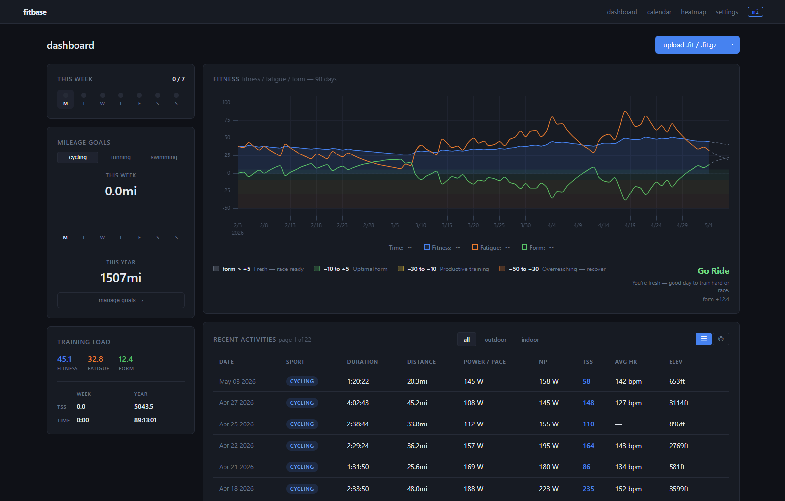

# fitbase

[](https://github.com/jonathanzuramski/fitbase/actions/workflows/ci.yml)
[](https://go.dev)
[](LICENSE)

Self-hosted fitness platform for endurance athletes. Your data, on your machine.

Garmin, Wahoo, and TrainingPeaks lock your workouts behind their clouds and charge a subscription to analyze data you already own. With fitbase you own your data: sync your FIT files however you like — intervals.icu, Dropbox, USB, or direct upload — and keep everything in a local SQLite database. A clean REST API makes it all available to coaching agents, dashboards, or whatever you want to build.

**No cloud dependency. No subscriptions. No data hostage situations.**



---

## Features

- **Automatic import** — drop a `.fit` file in a watched directory and it's parsed and stored
- **Sync from anywhere** — intervals.icu (Wahoo/Garmin/Strava bridge), Dropbox, USB, or web upload
- **Power analytics** — NP, IF, TSS, Variability Index, eFTP, and an all-time power curve overlaid on every ride
- **Heart rate analytics** — hrTSS for non-power activities, HR zones, Efficiency Factor
- **Training load** — Fitness/Fatigue/Form chart, accurate from day one thanks to a 180-day EMA warmup
- **Zone-colored charts + GPS route map** — power and HR colored by zone, route on a dark Leaflet map
- **Google Drive backup** — FIT files archived automatically, full restore in one command
- **LLM-ready API** — compact `/summary` endpoint built for coaching agents and function calling
- **Single binary** — pure Go. No CGO, no npm, no Docker required

---

## Quick start

### Docker (recommended)

Docker lets you run fitbase in a self-contained box without installing Go or any other dependencies. If you've never used it, install [Docker Desktop](https://www.docker.com/products/docker-desktop/) (Windows/Mac) or [Docker Engine](https://docs.docker.com/engine/install/) (Linux) first — that's the only prerequisite.

Then, from the folder containing the repo's `docker-compose.yml`, run:

```bash
docker compose up -d
```

Here's what that does:

- **`docker compose`** reads the `docker-compose.yml` file, which describes how to run fitbase.
- It **downloads the prebuilt image** from GitHub Container Registry (no building required) and starts it.
- **`-d`** ("detached") runs it in the background so it keeps going after you close the terminal.

That's it. Open **`http://localhost:8780`** in your browser and you'll see the setup screen.

A few commands worth knowing:

```bash
docker compose logs -f      # watch the logs (Ctrl+C to stop watching)
docker compose down         # stop fitbase
docker compose pull         # download the latest version...
docker compose up -d        # ...then restart to apply it
```

Your data (database, encryption key, FIT archive) lives in `/data` inside the container, mapped to a Docker volume so it survives restarts and updates.

**Prefer a folder you can see on your own machine?** Skip Compose and run the container directly, pointing `-v` at a real path:

```bash
docker run -d --name fitbase --restart unless-stopped \
  -p 8780:8780 \
  -v /path/to/your/data:/data \
  ghcr.io/jonathanzuramski/fitbase:latest
```

Replace `/path/to/your/data` with wherever you want the files to live (e.g. `~/fitbase-data`). The `-p 8780:8780` part maps the container's port to your machine, and `--restart unless-stopped` brings fitbase back automatically after a reboot.

**Running on TrueNAS Scale?** Go to **Apps → Discover Apps → Custom App**, paste the same service definition from `docker-compose.yml`, and point the volume at a dataset you've created for fitbase.

### From source

```bash
git clone https://github.com/jonathanzuramski/fitbase
cd fitbase
go build -o fitbase ./cmd/fitbase
./fitbase
```

Open `http://localhost:8080`. On first run you'll set up your profile (FTP, weight, HR zones), then drop a `.fit` file into `~/.fitbase/watch/` to import it.

---

## Getting files onto fitbase

Most head units store clean FIT files, but getting them off usually means plugging in over USB and copying by hand. To avoid the hassle of manually syncing, fitbase pulls from intermediaries that grab your activities automatically:

- **intervals.icu** (recommended) — a free platform that pulls from Wahoo, Garmin, and Strava. Connect it under **Settings**, enter your Athlete ID + API key, and hit **Sync Now**.
- **Dropbox** — Wahoo head units can sync FIT files here directly. Enter your token and folder path in **Settings**.
- **Web upload** — the dashboard upload button, or `POST /api/upload` with a `.fit`/`.fit.gz` file.
- **USB** — copy `.fit` files from your device's `ACTIVITIES/` folder into `~/.fitbase/watch/`.

Only one integration can auto-sync future workouts at a time; enabling one disables the other.

---

## Configuration

All config is via environment variables, and the defaults work out of the box:

| Variable              | Default                 | Description                                       |
| --------------------- | ----------------------- | ------------------------------------------------- |
| `FITBASE_PORT`        | `8780`                  | HTTP listen port                                  |
| `FITBASE_DB_PATH`     | `~/.fitbase/fitbase.db` | SQLite database path                              |
| `FITBASE_KEY_PATH`    | `~/.fitbase/master.key` | Path to your AES-256 master key                   |
| `FITBASE_WATCH_DIR`   | `~/.fitbase/watch`      | Directory watched for new FIT files               |
| `FITBASE_ARCHIVE_DIR` | `~/.fitbase/archive`    | Local archive of original FIT files               |
| `FITBASE_DEV`         | `false`                 | `true` serves templates from disk (live reload)   |

---

## Security

fitbase encrypts all integration credentials and OAuth tokens with **AES-256-GCM** before they touch the database. On first run it generates a random 256-bit key at `~/.fitbase/master.key` (`0600` permissions) and stores it separately from the database — so a leaked `.db` file alone is useless.

Want to supply your own key? Point `FITBASE_KEY_PATH` at a 32-byte file and fitbase will use it instead of generating one.

> **Back up both `fitbase.db` and `master.key`.** The key decrypts your stored credentials — lose it and you'll need to reconnect each integration (your workout data is unaffected). Don't commit the key to version control.

---

## Google Drive backup

fitbase can mirror every imported FIT file to Google Drive and rebuild your entire history onto a fresh server.

Create an OAuth app in the [Google Cloud Console](https://console.cloud.google.com) (enable the **Drive API**, create **Desktop** OAuth credentials), enter the Client ID + Secret under **Settings → Google Drive**, and connect. From then on, files upload to `fitbase-archive/YYYY/MM/{id}.fit` in the background. fitbase only ever touches files it creates.

To restore on a new install after connecting Drive:

```bash
curl -X POST http://localhost:8080/api/integrations/gdrive/restore
```

---

## API

Full spec in [`openapi.yaml`](./openapi.yaml), which doubles as a tool schema for function calling. A few key endpoints:

```
GET    /api/workouts                  list workouts
GET    /api/workouts/{id}/summary     compact summary for LLMs
GET    /api/workouts/{id}/analysis    zones, variability, 90-day comparison
GET    /api/athlete/readiness         today's form, ramp rate, recommendation
GET    /api/athlete/power-curve       all-time best power at each duration
GET    /api/fitness?days=90           Fitness/Fatigue/Form history
POST   /api/upload                    upload a .fit file
```

The API is built for AI coaching agents. A good call sequence: start with `/athlete/readiness` for today's state, `/athlete/power-curve` and `/athlete/zones` for capability, `/training/weekly` for patterns, then `/workouts/{id}/analysis` for specific feedback. The `/summary` endpoint returns a compact, function-call-friendly shape:

```json
{
  "data": {
    "id": "75336285a477ca34",
    "date": "2026-03-19",
    "sport": "cycling",
    "duration_mins": 138.4,
    "distance_km": 59.0,
    "avg_power_watts": 154,
    "normalized_power_watts": 164.5,
    "tss": 99.9,
    "intensity_factor": 0.658
  }
}
```

---

## Data layout

```
~/.fitbase/
├── fitbase.db            SQLite — all parsed workout data and streams
├── master.key            AES-256 key for OAuth tokens (600 permissions)
├── watch/                drop .fit files here for auto-import
└── archive/2026/03/      original FIT files, untouched
```

The database is fully derived from the archived FIT files and can be rebuilt anytime — the archive is the source of truth.

---

## Development

```bash
FITBASE_DEV=true go run ./cmd/fitbase   # run with live template reload
go test ./...                           # tests
go vet ./...                            # lint
```

`FITBASE_DEV=true` serves templates and static files from disk, so HTML/CSS/JS changes show up on a browser refresh — no rebuild needed.

### Project layout

The whole thing compiles to one Go binary. `cmd/` holds the entry point; everything else lives under `internal/`, split into small single-responsibility packages. Go's `internal/` rule means nothing here is importable from outside the module, so these are free to change without breaking anyone.

```
cmd/fitbase/main.go         Entry point — loads config, opens the DB, starts the watcher and sync jobs, mounts the HTTP server

internal/
  api/                      JSON REST API
    router.go               Route table — maps URL paths to handlers
    handlers.go             Core endpoints: workouts, athlete, fitness, training, upload
    response.go             Shared {"data": ...} / {"error": ...} envelope helpers
    intervals_handler.go    intervals.icu connect/sync endpoints
    dropbox_handler.go      Dropbox connect/sync endpoints
    gdrive_handler.go       Google Drive connect/backup/restore endpoints

  web/                      Server-rendered UI (Go html/template, no JS framework)
    web.go                  Template loading (embedded in prod, from disk when FITBASE_DEV=true)
    handlers.go             Page handlers — dashboard, workout, settings, welcome
    calendar.go             Calendar view data assembly
    template_funcs.go       Custom template helpers (formatting, zone colors, …)
    templates/              base.html + one file per page
    static/                 css/ (dark theme), js/ (uPlot charts, heatmap), images/

  db/                       SQLite persistence layer
    schema.sql              Table definitions — the source of truth for the schema
    db.go                   Open(), migrations (ALTER TABLE on startup), and all queries — plain database/sql, no ORM

  models/workout.go         Shared domain types (Workout, Athlete, stream samples, zones)
  config/config.go          Reads FITBASE_* environment variables into a Config struct
  crypto/crypto.go          AES-256-GCM encrypt/decrypt for credentials stored in the DB

  fitparser/parser.go       Decodes raw .fit (and .fit.gz) bytes into a Workout + per-second streams
  fitness/                  Analytics over a parsed workout
    power.go                Normalized Power, Intensity Factor, TSS, Variability Index, eFTP
    load.go                 Fitness/Fatigue/Form (CTL/ATL/TSB) via EMA over training history
    zones.go                Power and HR zone boundaries and time-in-zone
  route/route.go            GPS route extraction and matching workouts to the same course

  importer/watcher.go       Watches FITBASE_WATCH_DIR and runs the import pipeline on new files
  syncer/                   Pulls activities from cloud sources on a schedule
    sync_manager.go         Coordinates which integration auto-syncs (only one at a time)
    intervals_sync.go       intervals.icu pull job
    dropbox_sync.go         Dropbox pull job
  intervals/intervals.go    intervals.icu API client
  dropbox/dropbox.go        Dropbox API client
  gdrive/gdrive.go          Google Drive client — background upload + full restore

openapi.yaml                REST API spec — keep it in sync with the api/ handlers
```

**How a workout flows through the system:**

1. A `.fit` file arrives — dropped in the watch dir (`importer/`), pulled from the cloud (`syncer/` → `intervals/` or `dropbox/`), or uploaded via `api/`.
2. `fitparser/` decodes it into a `Workout` plus per-second streams (`models/`).
3. `fitness/` computes the derived metrics (power, load, zones); `route/` handles GPS.
4. `db/` persists everything to SQLite, and `gdrive/` archives the original file in the background.
5. Reads go the other way: `web/` renders pages and `api/` serves JSON, both querying `db/`.

A few conventions worth knowing before you dig in:

- **Plain `database/sql`** — no ORM. Queries live in `db/db.go`.
- **Schema changes are additive** — add `ALTER TABLE` migrations in `db.Open()` rather than editing `schema.sql` history.
- **`log/slog`** for all server-side logging — no `fmt.Print` in production paths.
- **Standard `testing` only** — no external frameworks. Tests run against real SQLite and real FIT decoding, so there are no mocks to wire up.
- **`openapi.yaml` leads** — update the spec before changing API handlers.

See [CONTRIBUTING.md](CONTRIBUTING.md) for the full guide, including how to add a feature and submit a PR.

---

## Roadmap

- [ ] **Mobile UI polish** — calendar sizing, graph rendering, metrics layout
- [ ] **Calendar mini power graph** — sparkline power curve in each day cell
- [ ] **Planned workouts & projected fitness** — schedule future workouts with target TSS and see the projected fitness trend
- [x] **User heatmaps** — a map view of the places you ride most
- [x] **Mileage goals** — set and track mileage targets

---

## Contributing

Contributions are welcome — please read [CONTRIBUTING.md](CONTRIBUTING.md) first. Bug reports are especially valuable: if a FIT file from your device won't parse, open an issue and attach the file.

## License

[MIT](LICENSE)
